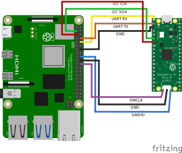

# Raspberry Pi Pico I2 slave <-> Raspberry Pi 4 I2C Master

This example shows how to read/write via I2C between a Pi Pico set as an I2C slave and a raspberry Pi 4 set as an I2C Master

## Setup

Follow the instructions in [Getting started with Raspberry Pi Pico](https://datasheets.raspberrypi.org/pico/getting-started-with-pico.pdf) to setup your build environment. Then:

- Clone this repo
- `cd pico_i2c_slave`
- `mkdir build`, `cd build`, `cmake ../`, `make`
- copy `example_rpi4/example_rpi4.elf` to Raspberry Pico
- wire the Pico and RPI4, as per the wiring diagram
- Inspect I2C bus and set/read value
```
pi@raspberrypi:~/pico/pico_i2c_slave $ i2cdetect -l
i2c-1   i2c             bcm2835 (i2c@7e804000)                  I2C adapter
i2c-21  i2c             Broadcom STB :                          I2C adapter
i2c-20  i2c             Broadcom STB :                          I2C adapter

pi@raspberrypi:~/pico/pico_i2c_slave $ i2cdetect -y 1
     0  1  2  3  4  5  6  7  8  9  a  b  c  d  e  f
00:                         -- -- -- -- -- -- -- --
10: -- -- -- -- -- -- -- 17 -- -- -- -- -- -- -- --
...
70: -- -- -- -- -- -- -- --

pi@raspberrypi:~/pico/pico_i2c_slave $ i2cdump -y 1 0x17
No size specified (using byte-data access)
     0  1  2  3  4  5  6  7  8  9  a  b  c  d  e  f    0123456789abcdef
00: 00 00 00 00 00 00 00 00 00 00 00 00 00 00 00 00    ................
...
f0: 00 00 00 00 00 00 00 00 00 00 00 00 00 00 00 00    ................

pi@raspberrypi:~/pico/pico_i2c_slave $ i2cset -y 1 0x17 0x00 0x41

pi@raspberrypi:~/pico/pico_i2c_slave $ i2cdump -y 1 0x17
No size specified (using byte-data access)
     0  1  2  3  4  5  6  7  8  9  a  b  c  d  e  f    0123456789abcdef
00: 41 00 00 00 00 00 00 00 00 00 00 00 00 00 00 00    A...............
...
f0: 00 00 00 00 00 00 00 00 00 00 00 00 00 00 00 00    ................
```
Note: 
* Some debug info appear on the UART console, to connect to the UART console, follow steps from: [Getting started with Raspberry Pi Pico, chaper 4.5](https://datasheets.raspberrypi.org/pico/getting-started-with-pico.pdf)
* Pico is powered from the RPI4, via USB, as per the Getting started guide.
* Image is flashed as described in: [Getting started with Raspberry Pi Pico, Chapter 5. Flash Programming with SWD](https://datasheets.raspberrypi.org/pico/getting-started-with-pico.pdf)
## Wiring

## Links
- [Pico C/C++ SDK](https://datasheets.raspberrypi.com/pico/raspberry-pi-pico-c-sdk.pdf)
- [Pico as I2C slave](https://www.raspberrypi.org/forums/viewtopic.php?t=304074) - basic setup using raw registers


